  

  

  

  

---

<table>
  <tr>
    <td width="58%" valign="top">

<h3 align="center">👨‍💻 About Me</h3>

Software Engineering undergraduate at Anhanguera and Systems Development Technician graduated from SENAI CTTI MG. I build practical software projects with a focus on backend, APIs, databases, local AI, IoT and software-hardware integration.

<ul>
  <li><strong>Education:</strong> Software Engineering — Anhanguera (in progress).</li>
  <li><strong>Technical background:</strong> Systems Development — SENAI CTTI MG.</li>
  <li><strong>Focus:</strong> backend development, APIs, databases and systems integration.</li>
  <li><strong>Interests:</strong> local AI, automation, IoT, embedded systems and software architecture.</li>
</ul>

</td>

<td width="42%" valign="top">

<h3 align="center">📊 GitHub Statistics</h3>

  

</td>
  </tr>
</table>

## 🧰 Tech Stack

  

---

## 🚀 Featured Projects

### Noa
Local desktop AI companion for Windows with text and voice interaction, persistent memory, document processing and permission-controlled actions.

**Stack:** TypeScript · Electron · Python · SQLite · Ollama

### OperaLink — Sistema Integrado de Operações e Monitoramento
Integrated operations platform that connects telemetry, physical and digital assets, software events, incidents and automation in a monitored and auditable workflow.

**Stack:** TypeScript · Next.js · NestJS · PostgreSQL · IoT

### Véspera: Ecos do Silêncio
2D action roguelite with rhythm-based combat, card-driven builds and an adaptive soundtrack that evolves with player performance.

**Stack:** Godot 4 · C#/.NET · Gameplay Systems

### Manopla Inteligente
Wearable IoT prototype inspired by Iron Man, combining gesture recognition, embedded firmware, visual and haptic feedback, telemetry and a web interface.

**Stack:** ESP32 · C++/Arduino · IoT · OpenSCAD · HTML/CSS/JS

---

<h3 align="center">🌐 Explore My Work</h3>

  More details, project context and my current résumé are available in my portfolio.

  

